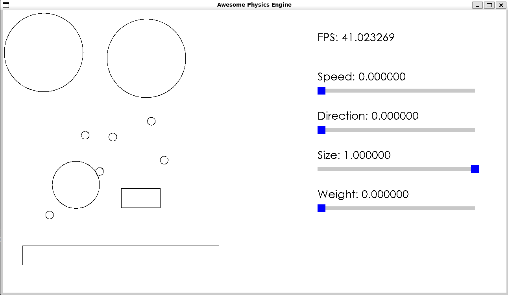

# cpp-physics-engine
Accurately inaccurate physics simulation with questionable performance



## Controls

- Use the sliders to configure the next shape you will add to the simulation environment.
- Click to instantiate a shape at the position of your mouse pointer.
- Use the arrow keys to move the camera around the environment.

## Building the Project

At ResMed, we used [Conan](https://conan.io/) for C++ package management. It caused a lot of trouble but more importantly, now I can finally include package management into `cpp=physics-engine`!

### Prerequisites
- C++ compiler with C++20 support (g++)
- Make
- Conan 2.x (`pip install conan`)

### Build Steps

1. Install dependencies with Conan:
```bash
conan install . --output-folder=build --build=missing
```

2. Build the project:
```bash
cd src
make
```

3. Run the executable:
```bash
./program
```

### Clean Build
```bash
cd src
make clean
```

# Physics concepts simulated

## Gravity

Gravity is simply a constant acceleration $9.8 ms^{-2}$ downwards. 

## Collision Impulse

Impulse is the change in momentum of an object. Since momentum is equal to velocity times weight ($p = mv$), we see that impulse($\Delta p = m \Delta v$) is dependent on the object's velocity and weight. This allows us to determine the result of the collision of objects.

For impulse resolution in our engine, we also consider the coefficient of restitution `e`, which is a measure of the elasticity of a collision between two bodies.

Hence, each object must have the properties:
- Velocity
- Position
- Mass
- Restitution

We also note that if we collide with another object, then <mark>each object recieves the impulse in the direction of the normal to the collision for each object</mark> (eg. a frictionless Tennis ball landing after Federer's serve will experience an impulse directly upwards, and the court will recieve an impulse downwards). Hence we use the magnitute of the impulse in the direction of the normal, so when calculating the impulse we use the velocity in the direction of the normal (by using a **dot product**).

# Design Choices

## Shape collision detection using `std::variant`

I knew that because it was necessary to have a different function for different combinations of shape collisions (Eg. Rectangle and Circle, Circle and Circle, etc), I needed a class that has all these functions in one place to prevent code repetition (and therefore improve maintainability).

I considered using basic polymorphism, where I would have a `collidesWith()` virtual method in `Shape.hpp` that would be resolved in each class with dynamic casting (into the actual type of the shape). However this still requires modifying every shape class when a new shape is added and `dynamic_cast` is not performative. Moreover, this approach doesn't really make use of useful C++ features. The use of `dynamic_cast` gives this approach the name 'Dynamic Dispatch'.

I decided to use `std::variant` which isn't OOP which means less coupling from the get-go. It is very useful in this scenario because it localises the collision logic to `Shape.cpp`, reducing any *Shotgun Surgery* code smell. It also provides a performance boost since no vtable lookup is required (because there are no virtual functions, because it is not actual polymorphism). `std::variant` is a type-safe union where using it with the associated function `std::visit`, we can determine the correct shape collision function to call within one function, and in a performative way.

# Engineering logbook

### Optimised circle rendering algorithm
- Improved observed fps by approx 10fps (30fps -> 40fps) by using a polygon approximation of circles to render them using lines, as opposed to the orginal algorithm which would use trigonometry to draw dots to make up the entire circle. 
- The new algorithm significantly reduces calls (in the count of thousands) to `sin()` and `cos()` which are costly CPU calls. It allows the SDL library to cleverly handle the rendering of the lines which make up the polygonal edges of the 'circle'. The obvious downside is that the graphical representation of the circles is not their true simulated shape.
- The performance boost is most noticeable when the number of objects simulated is large. With the optimisation, simulating large numbers of objects is a much more pleasant experience.

# Improvements to make:

- Currently, it will calculate the movement by going iteratively through each shape. This is not good because the later shapes will be affected by the changes in the earlier shapes. For a realistic simulation, the movement should be calculated such that the order of calculation does not matter.
- Multithreading: Rendering multithreading (lower priority), and collision calculation multithreading (higher priority). 