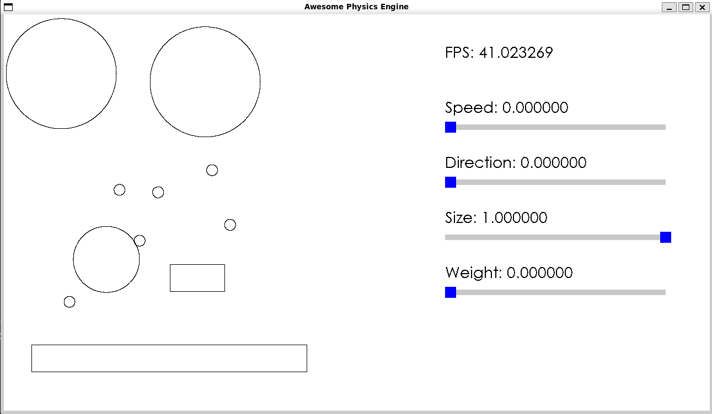

# cpp-physics-engine
Accurately inaccurate physics simulation with questionable performance



## Controls

- Use the sliders to configure the next shape you will add to the simulation environment.
- Click to instantiate a shape at the position of your mouse pointer.
- Use the arrow keys to move the camera around the environment.

## Building the Project

At ResMed, we used [Conan](https://conan.io/) for C++ package management. It caused a lot of trouble but more importantly, now I can finally include package management into `cpp=physics-engine`!

### Prerequisites
- C++ compiler with C++20 support (g++)
- Make
- Conan 2.x (`pip install conan`)

### Build Steps

1. Install dependencies with Conan:
```bash
conan install . --output-folder=build --build=missing
```

2. Build the project:
```bash
cd src
make
```

3. Run the executable:
```bash
./program
```

### Clean Build
```bash
cd src
make clean
```

# Physics concepts simulated

## Gravity

Gravity is simply a constant acceleration $9.8 ms^{-2}$ downwards. 

## Collision Impulse

Impulse is the change in momentum of an object. Since momentum is equal to velocity times weight ($p = mv$), we see that impulse($\Delta p = m \Delta v$) is dependent on the object's velocity and weight. This allows us to determine the result of the collision of objects.

For impulse resolution in our engine, we also consider the coefficient of restitution `e`, which is a measure of the elasticity of a collision between two bodies.

Hence, each object must have the properties:
- Velocity
- Position
- Mass
- Restitution

We also note that if we collide with another object, then <mark>each object recieves the impulse in the direction of the normal to the collision for each object</mark> (eg. a frictionless Tennis ball landing after Federer's serve will experience an impulse directly upwards, and the court will recieve an impulse downwards). Hence we use the magnitute of the impulse in the direction of the normal, so when calculating the impulse we use the velocity in the direction of the normal (by using a **dot product**).

# Design Choices

## Shape collision detection

2 ways were most apparent to me for making shape collision; `std::variant` and doulble dispatch. 
Initially, I used a `std::variant` implementation, but the code was challenging to read and overall not as fun to read and write.

Both solutions are quite good, as they don't have coupling. They also are not OOP which means that there is no override which also means no virtual table. This reduces latency since no vtable lookup is required. 

I might revisit the `std::variant` solution later, though I don't have insane hopes of it being great. 

# Engineering logbook

### Optimised circle rendering algorithm
- Improved observed fps by approx 10fps (30fps -> 40fps) by using a polygon approximation of circles to render them using lines, as opposed to the orginal algorithm which would use trigonometry to draw dots to make up the entire circle. 
- The new algorithm significantly reduces calls (in the count of thousands) to `sin()` and `cos()` which are costly CPU calls. It allows the SDL library to cleverly handle the rendering of the lines which make up the polygonal edges of the 'circle'. The obvious downside is that the graphical representation of the circles is not their true simulated shape.
- The performance boost is most noticeable when the number of objects simulated is large. With the optimisation, simulating large numbers of objects is a much more pleasant experience.

# Improvements to make:

- Currently, it will calculate the movement by going iteratively through each shape. This is not good because the later shapes will be affected by the changes in the earlier shapes. For a realistic simulation, the movement should be calculated such that the order of calculation does not matter.
- Multithreading: Rendering multithreading (lower priority), and collision calculation multithreading (higher priority). 